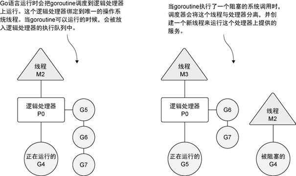

# Go 语言实战

date：20210920

source code：https://github.com/goinaction/code

code：https://github.com/huxiangyu99/goinaction

# 第 1 章 关于 Go 语言的介绍

## 1.1 用 Go 解决现代编程难题

l **开发速度**

l **并发**：goroutine、channel

l **类型系统**：类型简单、Go 接口对一组行为进行建模

l **内存管理**

 

# 第 2 章 快速开始一个 Go 程序

## 2.1 程序架构

 

# 第 3 章 打包和工具链

## 3.1 包

所有 Go 语言的程序都会组织成若干组文件，每组文件被称为一个包。这样每个包的代码都可以作为很小的复用单元，被其他项目引用。

l **包名惯例**

并不需要所有包的名字都与别的包不同，因为导入包时是使用全路径的，所以可以区分同名的不同包。一般情况下，包被导入后会使用你的包名作为默认的名字，不过这个导入后的名字可以修改。这个特性在需要导入不同目录的同名包时很有用。

l **main** **包**

命名为 main 的包具有特殊的含义。Go 语言的编译程序会试图把这种名字的包编译为二进制可执行文件。所有用 Go 语言编译的可执行程序都必须有一个名叫 main 的包。

当编译器发现某个包的名字为 main 时，它一定也会发现名为 main() 的函数，否则不会创建可执行文件。main() 函数是程序的入口，所以，如果没有这个函数，程序就没有办法开始执行。程序编译时，会使用声明 main 包的代码所在的目录的目录名作为二进制可执行文件的文件名。

## 3.2 导入

import 语句告诉编译器到磁盘的哪里去找想要导入的包。编译器会使用 Go 环境变量设置的路径，通过引入的相对路径来查找磁盘上的包。标准库中的包会在安装 Go 的位置找到。Go 开发者创建的包会在 GOPATH 环境变量指定的目录里查找。GOPATH 指定的这些目录就是开发者的个人工作空间。

l **远程导入**

使用分布式版本控制系统（Distributed Version Control Systems，DVCS）来分享代码。如果路径包含 URL，可以使用 Go 工具链从 DVCS 获取包，并把包的源代码保存在 GOPATH 指向的路径里与 URL 匹配的目录里。这个获取过程使用 go get 命令完成。

l **命名导入**

如果要导入的多个包具有相同的名字，重名的包可以通过命名导入来导入。有时，用户可能需要导入一个包，但是不需要引用这个包的标识符。在这种情况，可以使用空白标识符 _ 来重命名这个导入。

## 3.3 init 函数

每个包可以包含任意多个 init 函数，这些函数都会在程序执行开始的时候被调用。所有被编译器发现的 init 函数都会安排在 main 函数之前执行。init 函数用在设置包、初始化变量或者其他要在程序运行前优先完成的引导工作。

## 3.4 go 工具

go build/run/clean

l **go vet**

vet 命令会帮开发人员检测代码的常见错误。

\1)  Printf 类函数调用时，类型匹配错误的参数。

\2)  定义常用的方法时，方法签名的错误。

\3)  错误的结构标签。

\4)  没有指定字段名的结构字面量。

l **go fmt**

fmt 命令会自动格式化开发人员指定的源代码文件并保存。

l **godoc**

godoc 命令可以为开发者生成文档。

godoc -http=:6060

 

# 第 4 章 数组、切片和映射

## 4.1 array

l **内部实现**

数组是一种非常有用的数据结构，因为其占用的内存是连续分配的。由于内存连续，CPU 能把正在使用的数据缓存更久的时间。而且内存连续很容易计算索引，可以快速迭代数组里的所有元素。

l **声明和初始化**

一旦声明，数组里存储的数据类型和数组长度就都不能改变了。如果需要存储更多的元素，就需要先创建一个更长的数组，再把原来数组里的值复制到新数组里。

在 Go 语言中声明变量时，总会使用对应类型的零值来对变量进行初始化。

// 声明一个包含 5 个元素的整型数组（初始化为0）

var array [5]int

 

// 声明一个包含 5 个元素的整型数组

// 用具体值初始化每个元素

array := [5]int{10, 20, 30, 40, 50}

 

// 声明一个整型数组

// 用具体值初始化每个元素

// 容量由初始化值的数量决定

array := [...]int{10, 20, 30, 40, 50}

 

// 声明一个有 5 个元素的数组

// 用具体值初始化索引为 1 和 2 的元素

// 其余元素保持零值

array := [5]int{1: 10, 2: 20}

l **使用数组**

数组变量的类型包括数组长度和每个元素的类型。只有这两部分都相同的数组，才是类型相同的数组，才能互相赋值。

复制指针数组，只会复制指针的值，而不会复制指针所指向的值。复制值数组时会拷贝值。

l **多维数组**

// 声明一个二维整型数组，两个维度分别存储 4 个元素和 2 个元素

var array [4][2]int

// 使用数组字面量来声明并初始化一个二维整型数组

array := [4][2]int{{10, 11}, {20, 21}, {30, 31}, {40, 41}}

// 声明并初始化外层数组中索引为 1 个和 3 的元素

array := [4][2]int{1: {20, 21}, 3: {40, 41}}

// 声明并初始化外层数组和内层数组的单个元素

array := [4][2]int{1: {0: 20}, 3: {1: 41}}

l **函数传递数组**

在函数之间传递变量时，总是以值的方式传递的。如果这个变量是一个数组，意味着整个数组，不管有多长，都会完整复制，并传递给函数。

可以使用指针在函数间传递大数组，因为现在传递的是指针，所以如果改变指针指向的值，会改变共享的内存。使用切片能更好地处理这类共享问题。

## 4.2 slice

l **内部实现**

切片是一个很小的对象，对底层数组进行了抽象，并提供相关的操作方法。切片有 3 个字段的数据结构，这些数据结构包含 Go 语言需要操作底层数组的元数据。这 3 个字段分别是指向底层数组的指针、切片访问的元素的个数（即长度）和切片允许增长到的元素个数（即容量）。

l **创建和初始化**

\1)  make 和切片字面量

// 创建一个字符串切片

// 其长度和容量都是 5 个元素

slice := make([]string, 5)

 

// 创建一个整型切片

// 其长度为 3 个元素，容量为 5 个元素

slice := make([]int, 3, 5)

 

// 创建字符串切片

// 其长度和容量都是 5 个元素

slice := []string{"Red", "Blue", "Green", "Yellow", "Pink"}

 

// 创建一个整型切片

// 其长度和容量都是 3 个元素

slice := []int{10, 20, 30}

 

// 创建字符串切片

// 使用空字符串初始化第 100 个元素

slice := []string{99: ""}

\2)  nil 和空切片

// 创建 nil 整型切片

var slice []int

 

// 使用 make 创建空的整型切片

slice := make([]int, 0)

// 使用切片字面量创建空的整型切片

slice := []int{}

l **使用切片**

\1)  使用切片创建切片时，两个切片共享统一底层数组。

\2)  赋值操作（或在容量内 append 操作），会修改原来的底层数组。

\3)  切片增长

当 append 调用返回时，会返回一个包含修改结果的新切片。函数 append 总是会增加新切片的长度，而容量有可能会改变，也可能不会改变，这取决于被操作的切片的可用容量。

如果切片的底层数组没有足够的可用容量，append 函数会创建一个新的底层数组，将被引

用的现有的值复制到新数组里，再追加新的值。

函数 append 会智能地处理底层数组的容量增长。在切片的容量小于 1000 个元素时，总是会成倍地增加容量。一旦元素个数超过 1000，容量的增长因子会设为 1.25，也就是会每次增加 25%的容量。随着语言的演化，这种增长算法可能会有所改变。

\4)  创建切片时的三个索引

在创建切片时，还可以使用第三个索引选项。第三个索引可以用来控制新切片的容量。其目的并不是要增加容量，而是要限制容量。

对底层数组容量是 k 的切片 slice[i:j]

长度: j - i

容量: k - i

 

对于 slice[i:j:k] 或 [2:3:4]

长度: j – i 或 3 - 2 = 1

容量: k – i 或 4 - 2 = 2

\5)  迭代切片

当迭代切片时，关键字 range 会返回两个值。第一个值是当前迭代到的索引位置，第二个值是该位置对应元素值的一份副本。

l **多维切片**

可以组合多个切片形成多维切片。

l **函数传递切片**

在函数间传递切片就是要在函数间以值的方式传递切片。由于切片的尺寸很小，在函数间复制和传递切片成本也很低。

在 64 位架构的机器上，一个切片需要 24 字节的内存：指针字段需要 8 字节，长度和容量字段分别需要 8 字节。由于与切片关联的数据包含在底层数组里，不属于切片本身，所以将切片复制到任意函数的时候，对底层数组大小都不会有影响。复制时只会复制切片本身，不会涉及底层数组。

## 4.3 map

映射是一种数据结构，用于存储一系列无序的键值对。映射里基于键来存储值。映射功能强大的地方是，能够基于键快速检索数据。键就像索引一样，指向与该键关联的值。

l **内部实现**

映射是一个集合，可以使用类似处理数组和切片的方式迭代映射中的元素。但映射是无序的集合，意味着没有办法预测键值对被返回的顺序。即便使用同样的顺序保存键值对，每次迭代映射的时候顺序也可能不一样。无序的原因是映射的实现使用了散列表。

l **创建和初始化**

// 创建一个映射，键的类型是 string，值的类型是 int

dict := make(map[string]int)

 

// 创建一个映射，键和值的类型都是 string

// 使用两个键值对初始化映射

dict := map[string]string{"Red": "#da1337", "Orange": "#e95a22"}

l **使用映射**

可以通过声明一个未初始化的映射来创建一个值为 nil 的映射（称为 nil 映射）。nil 映射不能用于存储键值对，否则，会产生一个运行时错误。

从映射取值时有两个选择：第一个选择是，可以同时获得值，以及一个表示这个键是否存在的标志；另一个选择是，只返回键对应的值，然后通过判断这个值是不是零值来确定键是否存在（这种方法只能用在映射存储的值都是非零值的情况）。

// 获取键 Blue 对应的值，这个键存在吗？

if value, exists := colors["Blue"]; exists {

  fmt.Println(value)

}

 

// 获取键 Blue 对应的值，这个键存在吗？

if value := colors["Blue"]; value != "" {

  fmt.Println(value)

}

迭代映射里的所有值和迭代数组或切片一样，使用关键字 range，但对映射来说，range 返回的不是索引和值，而是键值对。

如果想把一个键值对从映射里删除，就使用内置的 delete 函数。

l **函数传递映射**

当传递映射给一个函数，并对这个映射做了修改时，所有对这个映射的引用都会察觉到这个修改。

 

# 第 5 章 Go 语言的类型系统

## 5.1 用户自定义类型

当用户声明一个新类型时，这个声明就给编译器提供了一个框架，告知必要的内存大小和表示信息。Go 语言里声明用户定义的类型有两种方法：

l **使用关键字 struct 创建一个结构类型**

这个声明以关键字 type 开始，之后是新类型的名字，最后是关键字 struct。

结构类型通过组合一系列固定且唯一的字段来声明，这个已知类型可以是内置类型，也可以是其他用户定义的类型。

// user 在程序里定义一个用户类型

type user struct {

  name string

  email string

  ext int

  privileged bool

}

 

// 声明 user 类型的变量，并初始化所有字段

lisa := user{

  name: "Lisa",

  email: "lisa@email.com",

  ext: 123,

  privileged: true,

}

 

// 声明 user 类型的变量，并初始化所有字段

lisa := user{"Lisa", "lisa@email.com", 123, true}

l **基于一个已有的类型，将其作为新类型的类型说明**

当需要一个可以用已有类型表示的新类型的时候，这种方法会非常好用。标准库使用这种声明类型的方法，从内置类型创建出很多更加明确的类型，并赋予更高级的功能。

需要进行显式类型转换，两种不同类型的值即便互相兼容，也不能互相赋值。编译器不会对不同类型的值做隐式转换。

## 5.2 方法

方法能给用户定义的类型添加新的行为。方法实际上也是函数，只是在声明时，在关键字 func 和方法名之间增加了一个参数。

Go 语言里有两种类型的接收者：值接收者和指针接收者。

l **值接收者**

func (u user) notify() {

}

如果使用值接收者声明方法，调用时会使用这个值的一个副本来执行。

也可以使用指针调用使用值接收者声明的方法。Go 编译器为了支持这种方法调用背后做的事情。指针被解引用为值，这样就符合了值接收者的要求（会复制指针指向的值的副本）。

// Go 在代码背后的执行动作

(*lisa).notify()

l **指针接收者**

func (u *user) changeEmail() {

}

当调用使用指针接收者声明的方法时，这个方法会共享调用方法时接收者所指向的值。值接收者使用值的副本来调用方法，而指针接受者使用实际值来调用方法。

也可以使用一个值来调用使用指针接收者声明的方法。Go 语言再一次对值做了调整，使之符合函数的接收者，进行调用。

(&bill).changeEmail("bill@newdomain.com")

## 5.3 类型的本质

l **内置类型**

内置类型有数值类型、字符串类型和布尔类型。这些类型本质上是原始的类型。因此，当对这些值进行增加或者删除的时候，会创建一个新值。当把这些类型的值传递给方法或者函数时，应该传递一个对应值的副本。

l **引用类型**

引用类型有切片、映射、通道、接口和函数类型。当声明上述类型的变量时，创建的变量被称作标头（header）值。因为标头值是为复制而设计的，所以永远不需要共享一个引用类型的值。标头值里包含一个指针，因此通过复制来传递一个引用类型的值的副本，本质上就是在共享底层数据结构。

l **结构类型**

结构类型可以用来描述一组数据值，这组值的本质即可以是原始的，也可以是非原始的。如果决定在某些东西需要删除或者添加某个结构类型的值时该结构类型的值不应该被更改，那么需要遵守之前提到的内置类型和引用类型的规范。

是使用值接收者还是指针接收者，不应该由该方法是否修改了接收到的值来决定。这个决策应该基于该类型的本质。例外：需要让类型值符合某个接口的时候，即便类型的本质是非原始本质的，也可以选择使用值接收者声明方法。这样做完全符合接口值调用方法的机制。

## 5.4 接口

多态是指代码可以根据类型的具体实现采取不同行为的能力。如果一个类型实现了某个接口，所有使用这个接口的地方，都可以支持这种类型的值。

l **标准库**

标准库里有很好的例子，如 io 包里实现的流式处理接口。io 包提供了一组构造得非常好的接口和函数，来让代码轻松支持流式数据处理。只要实现两个接口，就能利用整个 io 包背后的所有强大能力。

// io.Copy

func Copy(dst Writer, src Reader)

 

// fmt.Fprintf

func Fprintf(w io.Writer, format string, a ...interface{})

l **实现**

接口是用来定义行为的类型。这些被定义的行为不由接口直接实现，而是通过方法由用户定义的类型实现。如果用户定义的类型实现了某个接口类型声明的一组方法，那么这个用户定义的类型的值就可以赋给这个接口类型的值。

对接口值方法的调用会执行接口值里存储的用户定义的类型的值对应的方法。因为任何用户定义的类型都可以实现任何接口，所以对接口值方法的调用就是一种多态。用户定义的类型通常叫作**实体类型**，如果离开内部存储的用户定义的类型的值的实现，接口值并没有具体的行为。

 

接口值是一个两个字长度的数据结构，第一个字包含一个指向内部表的指针。这个内部表叫作 iTable，包含了所存储的值的类型信息。iTable 包含了已存储的值的类型信息以及与这个值相关联的一组方法。第二个字是一个指向所存储值的指针。将类型信息和指针组合在一起，就将这两个值组成了一种特殊的关系。

l **方法集**

方法集定义了接口的接受规则。

方法集定义了一组关联到给定类型的值或者指针的方法。定义方法时使用的接收者的类型决

定了这个方法是关联到值，还是关联到指针，还是两个都关联。

\1)  规范里描述的方法集

T 类型的值的方法集只包含值接收者声明的方法。

T 类型的指针的方法集既包含值接收者声明的方法，也包含指针接收者声明的方法。

| Values | Methods Receivers |
| ------ | ----------------- |
| T      | (t T)             |
| *T     | (t T) and (t *T)  |

\2)  从接收者类型的角度来看方法集

如果使用指针接收者来实现一个接口，那么只有指向那个类型的指针才能够实现对应的接口。

如果使用值接收者来实现一个接口，那么那个类型的值和指针都能够实现对应的接口。

| Methods Receivers | Values   |
| ----------------- | -------- |
| (t T)             | T and *T |
| (t *T)            | *T       |

因为不是总能获取一个值的地址，所以值的方法集只包括了使用值接收者实现的方法。

l **多态**

根据实现接口的用户自定义结构实体，表现不同的动作。

## 5.5 嵌入类型

嵌入类型（type embedding），是将已有的类型直接声明在新的结构类型里。被嵌入的类型被称为新的外部类型的内部类型。

通过嵌入类型，与内部类型相关的标识符会提升到外部类型上。这些被提升的标识符也是外部类型的一部分。这样外部类型就组合了内部类型包含的所有属性，并且可以添加新的字段和方法。外部类型也可以通过声明与内部类型标识符同名的标识符来覆盖内部标识符的字段或者方法。

要嵌入一个类型，只需要声明这个类型的名字就可以了。对外部类型来说，内部类型总是存在的。不指定内部类型对应的字段名，也可以使用内部类型的类型名，来访问到内部类型的值。

如果外部类型实现了 接口方法，内部类型的实现就不会被提升。不过内部类型的值一直存在，因此还可以通过直接访问内部类型的值，来调用没有被提升的内部类型实现的方法。

## 5.6 公开或未公开的标识符

标识符要么是从包里公开的，要么是在包里未公开的。

即便内部类型是未公开的，内部类型里声明的字段依旧是公开的。既然内部类型的标识符提升到了外部类型，这些公开的字段也可以通过外部类型的字段的值来访问。

 

# 第 6 章 并发

Go 语言里的并发指的是能让某个函数独立于其他函数运行的能力。为一个函数创建 goroutine 时，Go 会将其视为一个独立的工作单元。这个单元会被调度到可用的逻辑处理器上执行。

Go 语言的并发同步模型来自一个叫作通信顺序进程（Communicating Sequential Processes，CSP）的范型（paradigm）。CSP 是一种消息传递模型，通过在 goroutine 之间传递数据来传递消息，而不是对数据进行加锁来实现同步访问。用于在 goroutine 之间同步和传递数据的关键数据类型叫作通道（channel）。

## 6.1 并发与并行

l **操作系统的线程（thread）和进程（process）**

当运行一个应用程序的时候，操作系统会为这个应用程序启动一个进程。可以将这个进程看作一个包含了应用程序在运行中需要用到和维护的各种资源的容器。这些资源包括但不限于内存地址空间、文件和设备的句柄以及线程。

一个线程是一个执行空间，这个空间会被操作系统调度来运行函数中所写的代码。每个进程至少包含一个线程，每个进程的初始线程被称作主线程。当主线程终止时，应用程序也会终止。操作系统将线程调度到某个处理器上运行，这个处理器并不一定是进程所在的处理器。

 

l **协程**

操作系统会在物理处理器上调度线程来运行，而 Go 语言的运行时会在逻辑处理器上调度 goroutine 来运行。每个逻辑处理器都分别绑定到单个操作系统线程。Go 语言的运行时默认会为每个可用的物理处理器分配一个逻辑处理器。

调度器对可以创建的逻辑处理器的数量没有限制，但语言运行时默认限制每个程序最多创建 10 000 个线程。这个限制值可以通过调用 runtime/debug 包的 SetMaxThreads 方法来更改。如果程序试图使用更多的线程，就会崩溃。

操作系统线程、逻辑处理器和本地运行队列之间的关系：

\1)  如果创建一个 goroutine 并准备运行，这个 goroutine 就会被放到调度器的全局运行队列中。之后，调度器就将这些队列中的 goroutine 分配给一个逻辑处理器，并放到这个逻辑处理器对应的本地运行队列中。本地运行队列中的 goroutine 会一直等待直到自己被分配的逻辑处理器执行。

\2)  正在运行的 goroutine 需要执行一个阻塞的系统调用，如打开一个文件。当这类调用发生时，线程和 goroutine 会从逻辑处理器上分离，该线程会继续阻塞，等待系统调用的返回。调度器会创建一个新线程，并将其绑定到该逻辑处理器上。之后，调度器会从本地运行队列里选择另一个 goroutine 来运行。一旦被阻塞的系统调用执行完成并返回，对应的 goroutine 会放回到本地运行队列，之前的线程会保存好，以便之后可以继续使用。

\3)  如果一个 goroutine 需要做一个网络 I/O 调用，流程上会不一样。goroutine 会和逻辑处理器分离，并移到集成了网络轮询器的运行时。一旦该轮询器指示某个网络读或者写操作已经就绪，对应的 goroutine 就会重新分配到逻辑处理器上来完成操作。

l **并发****（concurrency）****和并行****（parallelism）**

并行是让不同的代码片段同时在不同的物理处理器上执行。并行的关键是同时做很多事情，而并发是指同时管理很多事情，这些事情可能只做了一半就被暂停去做别的事情了。

goroutine 并行，必须使用多于一个逻辑处理器。有多个逻辑处理器时，调度器会将 goroutine 平等分配到每个逻辑处理器上。否则，哪怕 Go 语言运行时使用多个线程，goroutine 依然会在同一个物理处理器上并发运行，达不到并行的效果。

只有在有多个逻辑处理器且可以同时让每个 goroutine 运行在一个可用的物理处理器上的时候，goroutine 才会并行运行。

## 6.2 goroutine

l **GOMAXPROCS** **函数**

GOMAXPROCS 函数允许程序更改调度器可以使用的逻辑处理器的数量。也可以通过修改和这个函数名字一样的环境变量的值来更改逻辑处理器的数量。

用这个函数，可以给每个可用的物理处理器在运行的时候分配一个逻辑处理器。

// 分配一个逻辑处理器给调度器使用

runtime.GOMAXPROCS(1)

 

// 给每个可用的核心分配一个逻辑处理器

runtime.GOMAXPROCS(runtime.NumCPU())

l **Gosched** **函数**

Gosched 函数，用于将 goroutine 从当前线程退出，给其他 goroutine 运行的机会。

// 当前 goroutine 从线程退出，并放回到队列

runtime.Gosched()

l **WaitGroup** **计数信号量**

WaitGroup 是一个计数信号量，可以用来记录并维护运行的 goroutine。如果 WaitGroup 的值大于 0，Wait 方法就会阻塞。关键字 defer 会修改函数调用时机，在正在执行的函数返回时才真正调用 defer 声明的函数。

// wg 用来等待程序完成

// 计数加 2，表示要等待两个 goroutine

var wg sync.WaitGroup

wg.Add(2)

 

// 在函数退出时调用 Done 来通知 main 函数工作已经完成

defer wg.Done()

 

// 等待 goroutine 结束

fmt.Println("Waiting To Finish")

wg.Wait()

l **调度算法**

基于调度器的内部算法，一个正运行的 goroutine 在工作结束前，可以被停止并重新调度。调度器这样做的目的是防止某个 goroutine 长时间占用逻辑处理器。当 goroutine 占用时间过长时，调度器会停止当前正运行的 goroutine，并给其他可运行的 goroutine 运行的机会。

\1)  调度器开始运行 goroutine A，而 goroutine B 在运行队列里等待调度。

\2)  调度器交换了 goroutine A 和 goroutine B。goroutine A 并没有完成工作，被放回运行队列。

\3)  goroutine B 完成了它的工作并被系统销毁。让 goroutine A 继续之前的工作。

## 6.3 竞争状态

如果两个或者多个 goroutine 在没有互相同步的情况下，访问某个共享的资源，并试图同时读和写这个资源，就处于相互竞争的状态，这种情况被称作竞争状态（race condition）。对一个共享资源的读和写操作必须是原子化的，换句话说，同一时刻只能有一个 goroutine 对共享资源进行读和写操作。

go build -race // 用竞争检测器标志来编译程序

## 6.4 锁

l **原子函数**

原子函数能够以很底层的加锁机制来同步访问整型变量和指针。

atomic.AddInt64(&counter, 1)

atomic.LoadInt64(&shutdown)

atomic.StoreInt64(&shutdown, 1)

l **互斥锁**

互斥锁这个名字来自互斥（mutual exclusion）的概念。互斥锁用于在代码上创建一个临界区，保证同一时间只有一个 goroutine 可以执行这个临界区代码。

// mutex 用来定义一段代码临界区

var mutex sync.Mutex

 

// 同一时刻只允许一个 goroutine 进入

mutex.Lock()

{

}

// 释放锁，允许其他正在等待的 goroutine

mutex.Unlock()

## 6.5 通道

可以使用通道，通过发送和接收需要共享的资源，在 goroutine 之间做同步。

当一个资源需要在 goroutine 之间共享时，通道在 goroutine 之间架起了一个管道，并提供了确保同步交换数据的机制。声明通道时，需要指定将要被共享的数据的类型，内置类型、命名类型、结构类型和引用类型的值或者指针。

// 无缓冲的整型通道

unbuffered := make(chan int)

 

// 有缓冲的字符串通道

buffered := make(chan string, 10)

 

// 通过通道发送一个字符串

buffered <- "Gopher"

// 从通道接收一个字符串

value := <-buffered

l **无缓冲的通道**

无缓冲的通道（unbuffered channel）是指在接收前没有能力保存任何值的通道。这种类型的通道要求发送 goroutine 和接收 goroutine 同时准备好，才能完成发送和接收操作。如果两个 goroutine 没有同时准备好，通道会导致先执行发送或接收操作的 goroutine 阻塞等待。

\1)  两个 goroutine 都到达通道，但哪个都没有开始执行发送或者接收。

\2)  左侧的 goroutine 将它的手伸进了通道，这模拟了向通道发送数据的行为。这时，这个 goroutine 会在通道中被锁住，直到交换完成。

\3)  右侧的 goroutine 将它的手放入通道，这模拟了从通道里接收数据。这个 goroutine 一样也会在通道中被锁住，直到交换完成。

\4)  进行交换。

\5)  两个 goroutine 都将它们的手从通道里拿出来，这模拟了被锁住的 goroutine 得到释放。

l **有缓冲的通道**

有缓冲的通道（buffered channel）是一种在被接收前能存储一个或者多个值的通道。这种类型的通道并不强制要求 goroutine 之间必须同时完成发送和接收。只有在通道中没有要接收的值时，接收动作才会阻塞。只有在通道没有可用缓冲区容纳被发送的值时，发送动作才会阻塞。

无缓冲的通道保证进行发送和接收的 goroutine 会在同一时间进行数据交换；有缓冲的通道没有这种保证。

\1)  右侧的 goroutine 正在从通道接收一个值。

\2)  右侧的这个 goroutine独立完成了接收值的动作，而左侧的 goroutine 正在发送一个新值到通道里。

\3)  左侧的goroutine 还在向通道发送新值，而右侧的 goroutine 正在从通道接收另外一个值。这个步骤里的两个操作既不是同步的，也不会互相阻塞。

\4)  所有的发送和接收都完成，而通道里还有几个值，也有一些空间可以存更多的值。

l **通道关闭**

当通道关闭后，goroutine 依旧可以从通道接收数据，但是不能再向通道里发送数据。能够从已经关闭的通道接收数据这一点非常重要，因为这允许通道关闭后依旧能取出其中缓冲的全部值，而不会有数据丢失。从一个已经关闭且没有数据的通道里获取数据，总会立刻返回，并返回一个通道类型的零值。如果在获取通道时还加入了可选的标志，就能得到通道的状态信息。

一旦接收到返回，就会检查 ok 标志，看通道是否已经清空而且关闭。如果 ok 的值是 false，goroutine 就会终止。如果 ok 标志是 true，表示接收到的值是有效的。

 

# 第 7 章 并发模式

##  7.1 runner

runner 包用于展示如何使用通道来监视程序的执行时间，如果程序运行时间太长，也可以用 runner 包来终止程序。

## 7.2 pool

展示如何使用有缓冲的通道实现资源池，来管理可以在任意数量的goroutine之间共享及独立使用的资源。推荐使用 sync.pool。

## 7.3 work

展示如何使用无缓冲的通道来创建一个 goroutine 池，这些 goroutine 执行并控制一组工作，让其并发执行。

 

# 第 8 章 标准库

文档：http://golang.org/pkg/

## 8.1 日志 

日志是一种找到这些 bug，更好地了解程序工作状态的方法。日志可以用来跟踪、调试和分析代码。

l **log** **包**

log 包日志记录器是多 goroutine 安全的。多个goroutine 可以同时调用来自同一个日志记录器的这些函数，而不会有彼此间的写冲突。标准日志记录器具有这一性质，用户定制的日志记录器也应该满足这一性质。

// 初始化

log.SetPrefix("TRACE: ")

log.SetFlags(log.Ldate | log.Lmicroseconds | log.Llongfile)

 

// 使用 3 个函数 Println/f、Fatalln/f 和 Panicln/f 来写日志消息

// 在调用 Println()之后会接着调用 panic()

log.Println("message")

log.Fatalln("fatal message")

log.Panicln("panic message")

l **定制的日志记录器**

func (l *Logger) Fatal(v ...interface{})

func (l *Logger) Fatalf(format string, v ...interface{})

func (l *Logger) Fatalln(v ...interface{})

func (l *Logger) Flags() int

func (l *Logger) Output(calldepth int, s string) error

func (l *Logger) Panic(v ...interface{})

func (l *Logger) Panicf(format string, v ...interface{})

func (l *Logger) Panicln(v ...interface{})

func (l *Logger) Prefix() string

func (l *Logger) Print(v ...interface{})

func (l *Logger) Printf(format string, v ...interface{})

func (l *Logger) Println(v ...interface{})

func (l *Logger) SetFlags(flag int)

func (l *Logger) SetPrefix(prefix string)

## 8.2 编码解码

// 编码

// MarshalIndent 很像 Marshal，只是用缩进对输出进行格式化

func MarshalIndent(v interface{}, prefix, indent string) ([]byte, error)

 

// 解码

// NewDecoder 返回从 r 读取的解码器

// 解码器自己会进行缓冲，而且可能会从 r 读比解码 JSON 值所需的更多的数据

func NewDecoder(r io.Reader) *Decoder

// Decode 从自己的输入里读取下一个编码好的 JSON 值，并存入 v 所指向的值里

// 要知道从 JSON 转换为 Go 的值的细节，请查看 Unmarshal 的文档

func (dec *Decoder) Decode(v interface{}) error

## 8.3 输入输出

l **Writer** **和 Reader 接口**

io.Writer 接口的文档：

Write 从 p 里向底层的数据流写入 len(p)字节的数据。这个方法返回从 p 里写出的字节数（0 <= n <= len(p)），以及任何可能导致写入提前结束的错误。Write 在返回 n < len(p)的时候，必须返回某个非 nil 值的 error。Write 不能改写切片里的数据。

// io.Writer 接口的声明

type Writer interface {

  Write(p []byte) (n int, err error)

}

io.Reader 接口的文档：

\1)  Read 最多读入 len(p) 字节，保存到 p。这个方法返回读入的字节数（0 <= n <= len(p)）和任何读取时发生的错误。即便 Read 返回的 n < len(p)，方法也可能使用所有 p 的空间存储临时数据。如果数据可以读取，但是字节长度不足 len(p)，习惯上 Read 会立刻返回可用的数据，而不等待更多的数据。

\2)  当成功读取 n > 0 字节后，如果遇到错误或者文件读取完成，Read 方法会返回读入的字节数。方法可能会在本次调用返回一个非 nil 的错误，或者在下一次调用时返回错误（同时 n == 0）。这种情况的的一个例子是，在输入的流结束时，Read 会返回非零的读取字节数，可能会返回 err == EOF，也可能会返回 err == nil。无论如何，下一次调用 Read 应该返回 0, EOF。

\3)  调用者在返回的 n > 0 时，总应该先处理读入的数据，再处理错误 err。这样才能正确操作读取一部分字节后发生的 I/O 错误。EOF 也要这样处理。

\4)  Read 的实现不鼓励返回 0 个读取字节的同时，返回 nil 值的错误。调用者需要将这种返回状态视为没有做任何操作，而不是遇到读取结束。

// io.Reader 接口的声明

type Reader interface {

  Read(p []byte) (n int, err error)

}